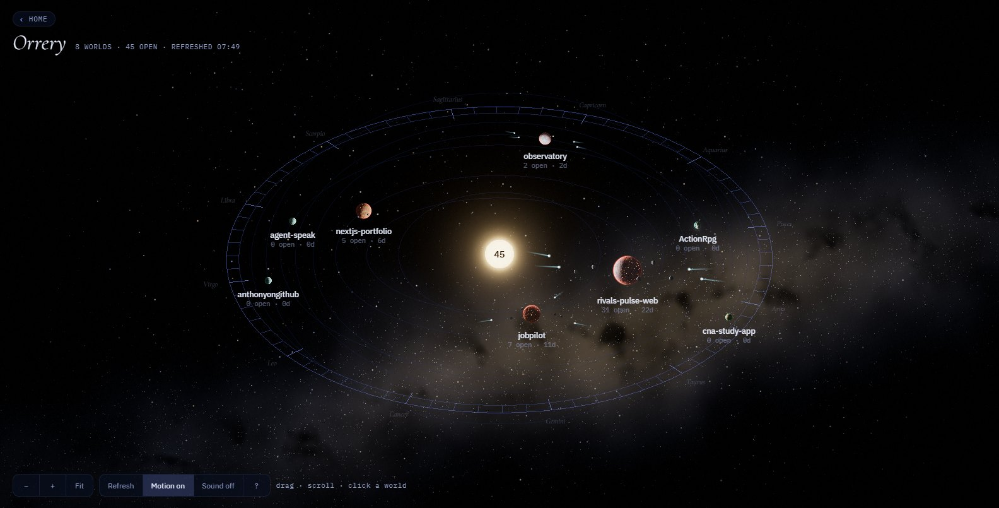
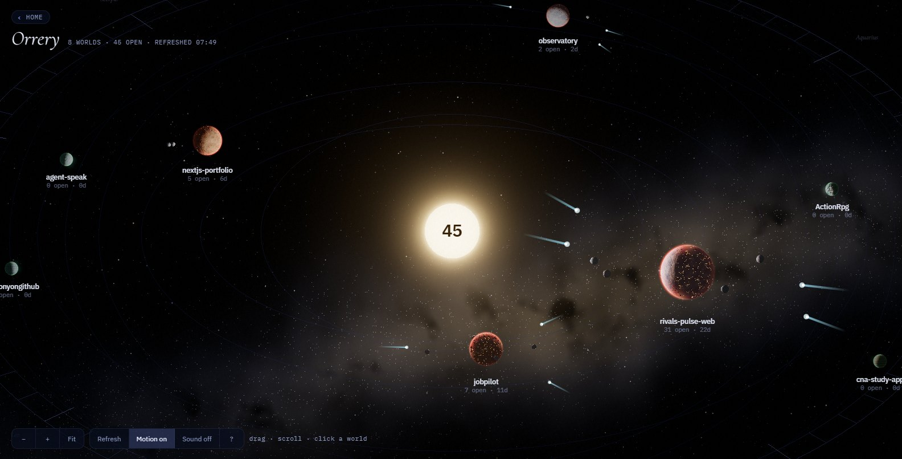
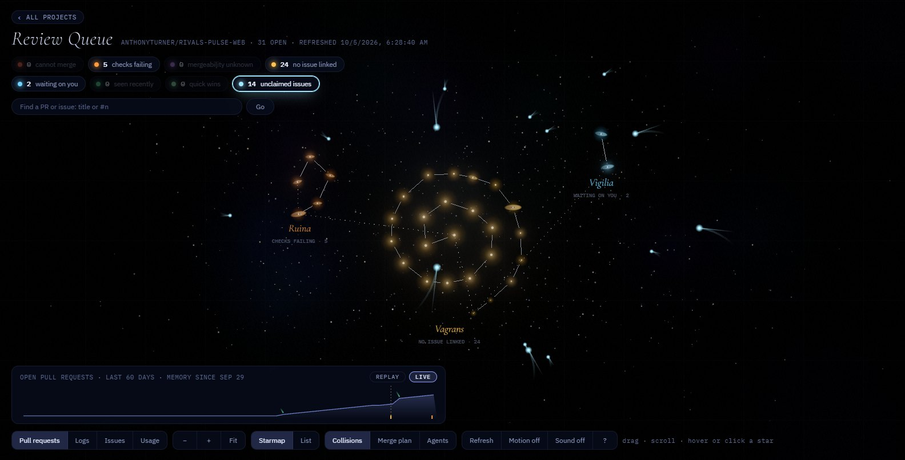
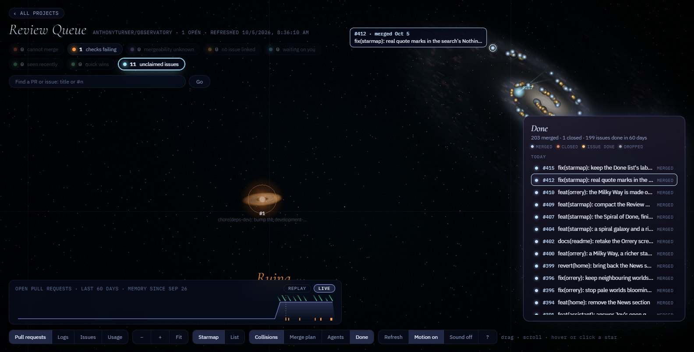

# Observatory

An AI OS for developers. Jev, its assistant, takes typed or spoken requests and
proposes coding-agent work that runs on your machine. Around him, your GitHub
work is drawn as a live, animated space scene:

- **Home**: a glowing core that shows what the assistant is doing, a card per
  project, Claude Code usage, news and mail.
- **The Orrery**: one world per project, its look driven by that project's
  health.
- **The review queue**: one star per open pull request, grouped by what blocks
  it, with a PR screen to review and merge without leaving the page.
- **Issues, logs and agent report cards** for each project.

Observatory is a rebuild of [pr-starmap](https://github.com/anthonyturner/pr-starmap),
whose pages grew into single HTML files thousands of lines long. It is being
migrated one small piece at a time into typed, tested Angular components.

> **Status:** Home, the Orrery and each project's star map are built, and all
> of them show live data from GitHub and Claude Code: project cards, usage,
> directives, news, the review queue, issues, logs and agent report cards.
> Jev, Home's assistant, answers typed or spoken requests and proposes work
> that can run on this machine.

## Reading the sky

Every mark that carries meaning is driven by your data; the rest is scenery,
kept the same for each project on every load. Each page's help card (press
`?`) has the one-line version, and
[docs/sky-visuals.md](docs/sky-visuals.md) has the rules behind each mark.

**The Orrery**: one world per project you own.

<table><tr>
<td></td>
<td></td>
</tr></table>

- **Air colour** is the project's most urgent state; a bigger world has more
  open work, and a world further out has been neglected longer.
- **City lights** on the night side are work in motion: more open pull
  requests, more lights, fading as the oldest goes stale.
- **Glowing cracks** mean checks are failing.
- **Moons** are blocked pull requests, a **ring** is branches that no longer
  merge, and **comets** are unclaimed issues.
- The specks in the **Milky Way** are what you shipped: every pull request
  merged in the last 60 days, in its project's colour, oldest at one end of the
  band and newest at the other.
- The kind of world (rocky, gas giant, ice or desert), its land and its clouds
  are scenery.

**The review queue**: one star per open pull request, grouped by what blocks
it and spaced along a spiral per group. Zoom in for detail.

<table><tr>
<td></td>
<td></td>
</tr></table>

- **Colour** is why it's stuck, and **size** is how long it has waited.
- **Kind**: a blocked pull request is a deep giant that throws flares, more
  often the longer it waits; one GitHub hasn't settled hides in a veil of gas;
  one waiting on you burns clear, with spikes; one you saw recently rests,
  small and calm.
- **The disc of gas** is review cost: larger and brighter the more lines
  change, green for a quick win, none under twenty lines.
- **Planets** are the issues it closes, up to four. No planets, no linked
  issue.
- **The spiral galaxy is the Spiral of Done:** everything merged, closed or
  finished in the last 60 days, newest at the arm tips and older work winding in
  to the core. **Done** lists it by day.

These are screenshots of the app running on real data, with only the public
repositories shown. Where WebGL can't start, both pages fall back to a
simpler flat drawing.

## Syncing the sky to music

On Home, **Sync** in the playlist bar makes the sky move with real sound.
Nothing is simulated, and nothing is recorded or sent. The arrow beside Sync
picks where it hears the music:

- **This tab** (Chrome and Edge): the playlist playing in Observatory. Tick
  "Share tab audio" when Chrome asks.
- **Whole computer** (Chrome and Edge on Windows and ChromeOS): everything the
  computer plays. Pick Entire screen and tick "Also share system audio".
- **Input device** (any desktop browser, Firefox and Safari included): an audio
  input, listed by name once you allow access. A microphone hears the room; for
  the computer's own sound use a loopback input:
  - Windows: **Stereo Mix**. In Sound settings, open More sound settings ›
    Recording, right-click the list, tick Show Disabled Devices, then enable
    Stereo Mix. If your sound card has none, install
    [VB-Audio Virtual Cable](https://vb-audio.com/Cable/).
  - macOS: install [BlackHole](https://existential.audio/blackhole/), and add a
    Multi-Output Device in Audio MIDI Setup so you still hear the music.
- **Sound card** (any browser, on the Windows PC running Observatory with
  `npm start`): everything the computer plays, read by Observatory’s own server
  from the speakers’ output. No prompt and nothing to set up. It is offered
  only when that server can capture, so never on the hosted site.
- **Microphone** (phones): no phone browser lets a page hear its sound
  directly, so Sync listens through the phone's microphone. It hears the room,
  the phone's own speaker included, so play the music out loud; with
  headphones on it hears none of it. It opens only when you press Sync.

## Stack

- **Angular 22**: standalone components, signals, `OnPush` change detection
- **TypeScript 6**, strict mode
- **Angular CDK** for behaviour (overlays, focus management, accessibility,
  breakpoints), with a hand-built design system instead of a component library
- **Three.js** for the 3D core, the Orrery and the review queue sky, drawn with
  procedural shaders (no textures), each with a Canvas 2D fallback
- **Vitest** for unit tests, **angular-eslint** and **Prettier** for code quality

## Principles

The code is written to SOLID and Clean Code standards
([docs/stack/clean-code.md](docs/stack/clean-code.md)): small single-purpose
components and services, dependencies on interfaces rather than concrete
implementations, and no file that does more than one job.

## Running it

Requires Node.js 24.15 or newer.

```bash
npm ci
npm start          # http://localhost:4200
npm test -- --watch=false
npm run test:server
npm run lint
npm run build
```

## Live data

The usage meters (tokens today, the 5-hour window and the weekly limit), the
project cards and Open issues are live. `npm start` runs Observatory's own API (`server/`, on port 4319) next to
the Angular dev server, which proxies `/api` to it. The API reads Claude Code's
files on this machine, so it listens on loopback only:

- **Tokens** come from Claude Code's session logs in `~/.claude/projects`, each
  reply counted once, by local day and model family.
- **Limits** are read by the API every few minutes from the usage endpoint
  `/usage` itself reads, with the Claude Code sign-in in
  `~/.claude/.credentials.json` (the token is never logged or sent anywhere
  else). That endpoint is undocumented, so your status line can record them
  too; the status line never runs in the VS Code extension's chat. Add this to
  a Node status line script, where `status` is the JSON it was given on stdin:

  ```js
  import('file:///path/to/observatory/server/usage/limit-recorder.ts')
    .then((m) => m.record(status))
    .catch(() => {});
  ```

  Readings are kept in `~/.claude/observatory/usage/`. Without them the limit
  meters say so rather than showing a number.

- **Projects** (the cards, Open issues, Directives, the Documents tabs and the top bar) are every repository the account signed in to the
  [GitHub CLI](https://cli.github.com/) owns (no forks or archives), read
  through `gh` and cached for five minutes. Each open pull request is counted
  in its most urgent state: cannot merge, checks failing, mergeability
  unknown, no issue linked, or waiting on you.

- **Review queue** (`/p/<owner>/<repo>`, reached from an Orrery world): the
  open pull requests as a star map or a list, blocked first, with a panel per
  pull request and the Issues tab.
- **Usage** (`#usage` on a star map): the plan limits, this week reading by
  reading with where the pace leads, earlier weeks, and a month of tokens by
  day, model, project and tool. Sessions are counted to the GitHub checkout
  (or worktree) they ran in. Read every minute while the screen is open.
- **Triage**: mark a pull request seen, snooze it or dismiss it until it
  changes. Kept in `~/.claude/observatory/triage/`; nothing is written to
  GitHub.
- **Since you last looked**: each read of a queue from GitHub may record a
  frame (every open pull request's bucket) in `~/.claude/observatory/history/`,
  and the review queue lists and marks what changed since your last visit.
  GitHub keeps no history of mergeability, so this starts from the first frame.

- **Collision courses**: pairs of open pull requests that change the same file
  are merged in memory with `git merge-tree` in a local clone, to show which
  would conflict with each other: a red thread on the star map, and a list in
  each panel. Pull request heads are fetched into `refs/observatory/` and
  deleted afterwards; branches and files are never touched. The clone is found
  in `~/.claude/observatory/clones.json` (`{"owner/repo": "path"}`) or by
  scanning `OBSERVATORY_CLONES_ROOT` (by default the folder holding this
  checkout). Without one, the pairs are shown as unchecked, never as safe.

- **Log sky**: an app's own log folder, read by `GET /api/logs?repo=owner/name`
  at most every five minutes. It understands Overwolf's log format
  (`2026-09-23 01:43:37,307 (INFO) <source> (:1) - message`), one window per
  file. The page never sees raw lines: numbers, JSON payloads and URL paths are
  stripped first (they carry most of a log's personal data, such as player ids
  and names inside match payloads), and repeats fold into one fault per window.
  The 160 loudest faults are kept, errors first; the totals still count
  everything. Point a repository at its folder once:

  ```
  node server/logs/set-dir.ts owner/repo "C:\Users\you\AppData\Local\Overwolf\Log\Apps\Your App"
  ```

  The folder is kept in `~/.claude/observatory/logs.json`
  (`{"owner/repo": "<folder>"}`). Without one, the API answers
  `{"configured": false}`.

- **Agent report cards** (the star map's **Agents**): how each coding agent's
  pull requests fare once handed back. They rest on a record of who opened
  what, made by a Claude Code hook that appends to
  `~/.claude/observatory/handoffs.jsonl`. Each card says whether its
  attribution is **named** (the hook recorded the agent), **inferred** (an
  agent in the same session finished within fifteen minutes) or
  **unattributed** (credited to the main session, never guessed). Add the hook
  to your Claude Code settings (`~/.claude/settings.json`), with the path to
  this checkout:

  ```json
  "hooks": {
    "PostToolUse": [
      { "matcher": "Bash|PowerShell",
        "hooks": [{ "type": "command", "command": "node /path/to/observatory/server/agents/capture.ts", "timeout": 10 }] }
    ],
    "SubagentStop": [
      { "hooks": [{ "type": "command", "command": "node /path/to/observatory/server/agents/capture.ts", "timeout": 10 }] }
    ]
  }
  ```

  The capture swallows every error, so a hook failure never breaks a tool call.
  Until it has recorded a pull request, the Agents panel says so. Point the
  command at a checkout that stays put (the main one, not a worktree).

  Coming from pr-starmap? Its hook wrote the same records into each
  repository's `.claude/queue/handoffs.jsonl`. `npm run agents:import-history`
  copies them in once, from every repository beside this one (or from the files
  you name), skipping any already recorded. Install this hook before removing
  pr-starmap's plugin, or handoffs in between go unrecorded.

- **News** (Home's News section, below the projects) comes from free public
  RSS and Atom feeds, read by the API at most every half hour with no key and
  no AI: AI news from Simon Willison, the GitHub Changelog (its AI items),
  Hacker News, Hugging Face, OpenAI, Google AI, The Verge and TechCrunch, with
  headlines about new tools listed first; software engineering from Hacker
  News, Lobsters, the GitHub Blog, InfoQ, The Pragmatic Engineer, Martin Fowler
  and the Stack Overflow Blog. The list is `server/news/news-sources.ts`. The
  hosted site reads the same feeds.

### Home's assistant (Jev)

`POST /api/route` answers a request typed or spoken on Home, and
`GET /api/route` says whether Jev is on and which skills there are.

**Local only.** Jev, its skills and the reply voice exist only on the local
site. The hosted site has no `/api/route` and no `/api/voice` at all, for
anyone, the owner included, and never reads an OpenRouter or ElevenLabs key
set there: an agent that reads your projects and proposes work in them
answers only on your own machine ([ADR-0006](docs/decisions/0006-keep-the-assistant-on-the-local-site-only.md)).
Home there shows one line in place of Ask, voice and skills.

- **Commands, instantly.** A request that names an app action in so many words
  ("open the orrery", "open the logs for observatory", "refresh") is matched by
  keyword, with no model call, so it is instant, free, and works with no key.
- **Everything else goes to Jev**, an agent on Claude Haiku. Where `claude` is
  on the PATH, Jev runs `claude -p` on your own Claude Code subscription, with
  no other account to pay; otherwise it uses OpenRouter, if a key is set (see
  below). It answers any question in plain words suited to being read aloud,
  and remembers the conversation: the page keeps the last 12 turns of this
  visit and sends them with each request (the server keeps nothing). **New
  conversation** makes Jev forget them.

Jev uses the dashboard as its tools, so it looks up the owner's data rather
than guessing:

- **Looks up**: the projects and their open pull requests counted by what
  blocks them; one project's open pull requests (bucket, days idle, whether it
  links an issue); its open issues; Claude Code usage and the plan's limits;
  and the web, for news or anything current, through Claude Code's web search
  and fetch (or OpenRouter's web search, on OpenRouter). The page lists the
  sources under the answer and never reads them aloud.
- **Does**: opens a page (the Orrery, Home, a project's star map, Issues, Logs
  or Usage), refreshes, opens the help card, and proposes a Claude Code task
  in a project.
- **Will not**: change code, run commands or touch GitHub itself. Work is only
  ever proposed, as a `claude -p` command to paste, quoted for this
  machine's shell. The proposal also carries a one-use token for **Run** (see
  below); nothing runs until you press it, and never from speech.

On Claude Code, Jev's tools reach it through a small MCP server on the local
API that lives for one request, and `claude -p` runs restricted: your own
settings, hooks and plugins are ignored, every tool that reads files or runs
commands is refused, it works in an empty scratch folder, and it is stopped
after 90 seconds. On OpenRouter a request takes at most six rounds of tool
calls and 45 seconds. Either way, if the model fails, Home says why and falls
back to keyword matches.

**Turning Jev on.** Install Claude Code and sign in, so `claude` is on the
PATH when the API starts; Jev then thinks on your subscription. Without it,
Jev can use an [OpenRouter](https://openrouter.ai/) key instead, which pays
for it. Locally, put the key in `~/.claude/observatory/.env` (outside the
checkout, so no commit can carry it) or set it in the environment:

```
OPENROUTER_API_KEY=<your key>
```

With neither, Jev is off and says so: only keyword matches work, and a request
can still be proposed as a command. An OpenRouter key is sent to OpenRouter
only, and scrubbed from every error and log line.

The same key writes the one-line summary on a Review Queue star's card, once
for each pushed commit, from the pull request's title, description and file
list. Without a key the card shows the risk tag alone.

**Skills** are fixed requests, one tile each on Home, each proposed as tier-3
work. The starters (triage the review queue, what's blocked, stale pull
requests, today's failures) only read, through named read-only `gh` commands.
Add, replace or remove them in `~/.claude/observatory/skills.json`, which is
read on every request (up to 64 KiB):

```json
{
  "deploys": {
    "label": "Check the deploys",
    "description": "Whether the last deploy of each app went out.",
    "prompt": "List the last deployment of each app in this repository ... Change nothing.",
    "project": "observatory"
  },
  "failures": null
}
```

An id is lower-case words joined by dashes; a label is up to 40 characters;
`project` pins a skill to one project; `null` removes a starter; there are at
most 24 skills in all.

### The reply voice (ElevenLabs)

Home reads its replies aloud in an [ElevenLabs](https://elevenlabs.io/) voice,
with Kokoro, which runs in the page itself, standing in whenever ElevenLabs
can't speak. ElevenLabs also hears you: `POST /api/voice/hear` turns a spoken
request into words with its Scribe model, with Whisper, in the page, standing
in. Hearing needs the key's speech-to-text permission.
`GET /api/voice` says whether it is on and lists the account's voices (kept for
ten minutes), and `POST /api/voice/speak` turns one sentence of up to 1,000
characters into MP3 audio in a chosen voice, with the `eleven_flash_v2_5` model.

**Picking the voice.** Under Speak in Home's voice block, choose "Kokoro · in
this browser" or ElevenLabs and one of the account's voices. The choice is kept
per browser, in local storage (`observatory.voice`), and starts as ElevenLabs. A
voice no longer on the account falls back to the default; when ElevenLabs is
off, not available or fails, the option says why, the status line says so once,
and Kokoro speaks for the rest of the visit.

**Turning it on.** Locally, put the key in `~/.claude/observatory/.env` or set
it in the environment, with the voice to start in if you like (a voice id from
your ElevenLabs account; otherwise the first one listed):

```
ELEVENLABS_OBSERVATORY_KEY=<your key>
ELEVENLABS_VOICE_ID=<optional voice id>
```

The key has a name of its own rather than the usual `ELEVENLABS_API_KEY`,
which other tools read, so a machine-wide key set for one of them cannot
override Observatory's. `ELEVENLABS_API_KEY` is ignored.

Without a key the voice is off, makes no call, and the page falls back to
Kokoro. The key is sent to ElevenLabs only, in its own header, and scrubbed
from every error and log line. Like Jev, the voice is local only.

**Taking turns with Agent Speak.** On this machine, Jev and
[Agent Speak](https://github.com/anthonyturner/agent-speak) never talk over
each other. While any line of Jev's is under way, the page renews a hold every
2 s. The local server keeps it as `~/.claude/agent-speak/.jev-speaking`
(`<expiryUnixMs>|<token>`, 6 s ahead), and Agent Speak pauses while it is
valid, then resumes where it stopped. A closed tab or stopped server lets the
hold lapse within 6 s, and one hold is never renewed past 5 minutes. Jev in
turn holds his news and mail while Agent Speak is busy, asking
`GET /api/agent-speech` once a second only while something waits. A pause you
set on Agent Speak is never touched: Observatory writes only that one file.

### Mail (iCloud and Gmail)

Home's Mail section, above the news, lists the 20 newest messages in your
iCloud and Gmail inboxes, one tab each: sender, subject, when it arrived and a
**New** mark on unread mail. `GET /api/mail?account=icloud|gmail` reads one
inbox over IMAP (the standard protocol mail apps read with), signing in with
an app password. It opens the Inbox read-only and fetches only each message's
flags and headers, so nothing Home does marks mail read. A list is kept for a
minute, and a slow or unreachable server is asked again after five minutes. A
refused sign-in is not tried again until you press Refresh or restart the site,
so a wrong password is never retried over and over until the provider locks
the account.

The page reads both inboxes on this machine only, once the API has confirmed
the session is local. It reads on every page, every five minutes while the tab
is in view, and once on coming back to a hidden tab. A message that arrives
after the first read and is still unread when it is found shows as a notice,
with its sender and subject, linking to Home's Mail. With Speak on, Jev says
it. With ElevenLabs as the voice he says only how many arrived, so no sender
or subject is sent to ElevenLabs. With Kokoro he names the sender and subject
of a lone message. A refused sign-in shows one quiet notice per tab and is
never spoken. No message body is read, and nothing is marked read.

**Turning it on.** Put an address and an app password for each account in
`~/.claude/observatory/.env`, or set them in the environment, then restart the
site. The password is never your account's own password:

```
ICLOUD_MAIL_ADDRESS=<your iCloud address>
ICLOUD_MAIL_APP_PASSWORD=<an app-specific password>
GMAIL_ADDRESS=<your Gmail address>
GMAIL_APP_PASSWORD=<a Google app password>
```

- **iCloud:** sign in at [account.apple.com](https://account.apple.com), open
  **Sign-In and Security → App-Specific Passwords**, and make one for
  Observatory. Two-factor authentication must be on. Apple's own mail
  settings give the part of the address before the @ as the username: if the
  full address is refused, try that.
- **Gmail:** make an app password at
  [myaccount.google.com/apppasswords](https://myaccount.google.com/apppasswords).
  The page appears only once 2-Step Verification is on. Google shows the
  password in four groups; paste it with or without the spaces.

An account without both settings shows a tab that names them, and makes no
call. The servers are fixed in code (`imap.mail.me.com` and `imap.gmail.com`,
port 993, TLS). The passwords go to those servers only, and are kept out of
every error and log line. Gmail's whole Inbox is listed, Promotions and Social
included. Like Jev, mail is local only: the hosted site has no mail route, for
anyone, even with these set there.

## The review queue in a terminal

The star map's review queue, as text, with the same triage:

```bash
npm run queue                                  # the queue for the checkout you ran it from
npm run queue -- owner/repo                    # or any repository
npm run queue -- owner/repo all                # dismissed and snoozed ones too, marked
npm run queue -- owner/repo seen 12            # also: unseen, dismiss, restore
npm run queue -- owner/repo snooze 12 3        # hidden for three days
npm run queue -- owner/repo --json             # for a script, or an agent
```

It lists open pull requests blocked first (cannot merge, checks failing,
mergeability unknown, no issue linked, waiting on you, then ones already
seen), each with the issue it closes and how long it has sat idle. It reads
GitHub through `gh` and keeps triage in the same store as the local site
(`~/.claude/observatory/`), so the star map shows a snooze made here at its
next read, and the other way round. A dismissal covers the pull request as it
stood: a later push brings it back. Like the site, it only triages; it never
merges, closes or pushes.

## Run: tier-3 work on this machine

A request that means work in a project, such as reading or changing code, can
become a proposal with a **Run** button. Once you confirm it, the local API
starts `claude -p --output-format stream-json --verbose` in that project's
clone and streams the output to the page, with Cancel and a list of recent
runs.

- **Where it runs.** Only the local API (`npm run api`, which `npm start`
  includes) can run anything. The hosted site has no runner: there `/api/runs`
  does not exist, and a proposal shows only the command to copy.
- **What it needs.** `claude` on the PATH, and a clone of the project, found
  the same way as for collision courses. Without either, the proposal says why
  and shows only the command.
- **What limits it.** A run needs a proposal token that works once, lasts five
  minutes, and only for the exact prompt and folder the proposal showed. The
  folder must be a known clone both when the token is made and when it is
  used. Only one run goes at a time, and each stops after 30 minutes. Cancel,
  or stopping the API, kills Claude Code and everything it started.
- **What it never does.** It never passes `--dangerously-skip-permissions` or
  any other permission flag: your own Claude Code allow rules and hooks apply,
  and `-p` refuses a tool they do not allow. It never puts the prompt on the
  command line, and never hands the server's own keys to the run. A cancelled
  run keeps whatever it already changed, so check `git status` in that folder.

[ADR-0005](docs/decisions/0005-run-tier-3-tasks-on-the-local-site-only.md)
records the decision and what any change to it must keep.

## Host it on Vercel

The same app runs on Vercel, for when you want Observatory away from this
machine. It charts every repository one GitHub account owns, keeps its data in
Upstash Redis, reads GitHub with a token the server holds instead of `gh`, and
lets in only the GitHub logins you name. Every page asks you to sign in with
GitHub first, unless you turn on the public preview.

The Angular build is served as static files, with every other address falling
back to `index.html`. Everything under `/api/` goes to one Node.js function
(`api/index.mjs`), which runs the same routes as `npm start` does here; Node 24
runs the server's TypeScript directly, so there is no server build step.

**Public preview.** Set `PUBLIC_PREVIEW` to `on` and anyone can look without
signing in: Home and the Orrery show your public repositories, and each one's
star map shows its pull requests, history, issues and collisions. With `on`, a
visitor never sees a private repository, not even its name. Set it to `all` to
show the private ones too. Either way a visitor never sees your triage or your
Claude Code usage, and cannot change anything: the server refuses every write,
and the page says it is a preview, with a link for you to sign in.

The Log Sky stays yours unless you set `PREVIEW_LOGS` to `on`. Visitors then see
it through a second scrub: anything shaped like an email, a token, key or
password value, a JWT, an IP address, a home folder, credentials in a URL, or a
long generated string is replaced with `[hidden]`.

It refreshes every project every six hours by itself (the cron reads each
repository's queue, which also records its history), and reads GitHub again
whenever a page asks after its cache has run out. Triage works as it does
locally, kept in the hosted store.

It needs a Vercel **Pro** plan as configured: `vercel.json` runs the cron every
six hours and lets the function run for up to 800 seconds, and Hobby allows
only a daily cron and 300 seconds. On Hobby, set the cron's schedule to once a
day (for example `0 6 * * *`) and `maxDuration` to 300.

### Going live

1. Create a Vercel project from this repository. `vercel.json` sets the
   framework (Angular), the build (`npm run build`), the output
   (`dist/observatory/browser`), the function and the cron; the Node.js
   version comes from `engines` in `package.json` (24.x).
2. Add **Upstash for Redis** to the project from the Vercel Marketplace. It sets
   `KV_REST_API_URL` and `KV_REST_API_TOKEN`.
3. Create a **GitHub OAuth app** (GitHub → Settings → Developer settings → OAuth
   Apps) whose callback URL is `https://<your site>/api/auth/callback`.
4. Create a **fine-grained GitHub token** for the account, with read access to
   the repositories' metadata, contents, pull requests and issues.
5. Set the environment variables below on the Vercel project, then deploy (a
   push to `main`, or a redeploy).
6. Open the site, sign in, and run the first push from this machine.

| Variable                                      | What it is                                                                                                      |
| --------------------------------------------- | --------------------------------------------------------------------------------------------------------------- |
| `KV_REST_API_URL`, `KV_REST_API_TOKEN`        | The Redis store. Adding Upstash for Redis from the Vercel Marketplace sets both.                                |
| `GITHUB_TOKEN`                                | A fine-grained token with read access to metadata, contents, pull requests and issues.                          |
| `GITHUB_OWNER`                                | The account whose repositories are charted.                                                                     |
| `GITHUB_CLIENT_ID`, `GITHUB_CLIENT_SECRET`    | A GitHub OAuth app whose callback is `https://<your site>/api/auth/callback`.                                   |
| `ALLOWED_LOGINS`                              | GitHub logins let in, comma separated.                                                                          |
| `SESSION_SECRET`, `CRON_SECRET`, `PUSH_TOKEN` | Random strings of 32 or more characters.                                                                        |
| `SITE_URL`                                    | Optional: your site's address, if sign-in should always return there.                                           |
| `PUBLIC_PREVIEW`                              | Optional: `on` lets anyone see your public repositories, read-only; `all` the private ones too. Off unless set. |
| `PREVIEW_LOGS`                                | Optional: `on` shows visitors the Log Sky, redacted. Off unless set.                                            |

A site missing one of the required variables answers every request saying
which. Generate the secrets with, for example,
`node -e "console.log(require('crypto').randomBytes(32).toString('base64url'))"`.

### Pushing from this machine

Some of what Observatory shows exists only here: the history frames recorded
while you worked locally, real merge checks between branches (they need a local
clone and `git`), each Log Sky whose folder is set here, your triage, and your
Claude Code usage. Push it up whenever
you like; it also brings a snooze or dismissal made on the hosted page home
into your local triage. For each pull request, whichever side changed its
triage last wins, so both end up the same.

```bash
npm run push -- --site=https://<your site> --token=<PUSH_TOKEN>   # once; remembered
npm run push                                                      # every repository Home charts
npm run push -- --repo=<owner/name>                               # one repository
```

The site and token are remembered in `~/.claude/observatory/push.json` (or set
`OBSERVATORY_SITE` and `OBSERVATORY_PUSH_TOKEN`). Without a push the hosted site
still works: collisions are then shown from the files pull requests share,
unchecked, the Log Sky says no folder is set, and the usage meters say there
are no readings. What a push brings shows at once.

## Working on it

Changes follow the workflow in [AGENTS.md](AGENTS.md): every change starts as a
GitHub issue and lands through a pull request.

### The wiki

The [wiki](https://github.com/anthonyturner/observatory/wiki) is generated from
this README, `CHANGELOG.md` and chosen `/docs` pages (the list is in
`server/wiki/wiki-pages.ts`) by the **Wiki sync** workflow on every merge to
main, so edit those files, not the wiki. The sync replaces only the pages it
wrote, which open with a `docs-wiki-sync` marker; pages written by hand on the
wiki stay. `npm run wiki:sync` writes the same pages to `dist/wiki` to read
before they go live.

The wiki's git repository exists only once its first page is saved in GitHub's
web UI. Until then the workflow passes with a notice saying so; save a page
named Home with any text (the first sync replaces it), then run **Wiki sync**
from the Actions tab.
