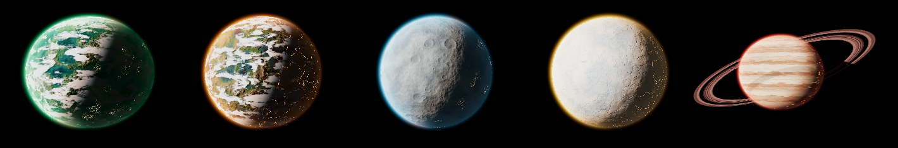
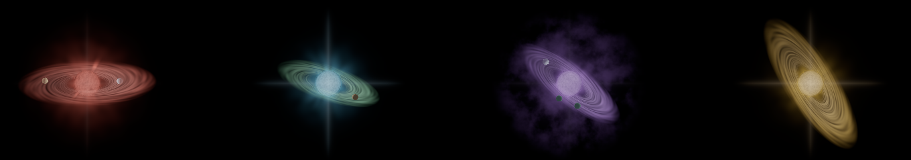

# Sky visuals: Orrery worlds, Review Queue stars, the Releases and Actions skies, and the Library

How the Orrery's worlds and the Review Queue's pull-request stars are drawn,
which data each mark carries, and how to change one safely. The help cards
(`orrery-help.ts`, `starmap-help/help-content.ts`) say what a mark _means_ in a
line; this page says how it works.

The Orrery and Review Queue sections describe the WebGL renderer. Each of those
skies also has a Canvas 2D fallback for when WebGL can't start or a shader
won't compile; the fallback keeps the older, simpler marks unless a section
says otherwise. The Releases and Actions skies are Canvas 2D only.

## Principle: meaning versus scenery

Every mark is either **data** or **scenery**, and the help cards say which.
Scenery (a world's kind, its land, its clouds, a star's granulation) is chosen
per repo or per star so it stays the same on every load, but it means nothing.
Data marks are each driven by one pure, tested function, so the rule lives in
TypeScript and the shader only draws it.

| Sky          | Mark             | Data                       | Rule (function)                |
| ------------ | ---------------- | -------------------------- | ------------------------------ |
| Orrery       | Air colour       | Most urgent state          | severity colour (`severityOf`) |
| Orrery       | City lights      | Open PRs, oldest idle days | `nightSide(project).lights`    |
| Orrery       | Glowing fissures | Failing checks             | `nightSide(project).unrest`    |
| Orrery       | Ring             | Conflicted branches        | `world.hasRing`                |
| Review Queue | Star type        | Bucket, idle days          | `starLook(star)`               |
| Review Queue | Gas disc         | Lines changed, quick win   | `massOf(star)`                 |
| Review Queue | Planets          | Issues the PR closes       | `issuePlanets(star)`           |
| Review Queue | Size             | Idle days                  | `mag` in `layoutQueue`         |
| Review Queue | Fall to the hole | Idle days past a threshold | `fallOf`, `placeByHole`        |
| Review Queue | Crew ship        | A crew run on the PR       | `crewPose(mark, clock)`        |
| Review Queue | Meteor           | Commits since you looked   | `meteorsOf`, `meteorLook`      |
| Review Queue | Satellite        | A live agent, its state    | `satellitesOf`, `isLit`        |
| Review Queue | Chain            | A PR stacked on another    | `stacksOf`, `chainLinks`       |
| Review Queue | Comet fade       | Open PRs past a WIP limit  | `wipCheck(items, limit)`       |
| Review Queue | Merge supernova  | A merged PR in the news    | `novaProgress`, `mergeCues`    |
| Review Queue | Weather          | Design red flags added     | `stormOf`, `designFlagsOf`     |
| Releases     | Star size        | Merged PRs it shipped      | `bodyRadius`, `roomAround`     |
| Releases     | Star colour      | Version bump, prerelease   | `bumpOf`, `releaseStarType`    |
| Releases     | Ring specks      | Merged PRs it shipped      | `ringSpeck`                    |
| Releases     | Comet tail knots | Unreleased PRs by week     | `weeksOf`, `tailSpeck`         |
| Actions      | Place on lane    | Run order, newest's age    | `frontDepth`, `layoutLanes`    |
| Actions      | Star size        | How long the run took      | `runRadius`                    |
| Actions      | Star type, flare | How the run went           | `runStarType`, `flareReach`    |
| Actions      | Pulse ring       | A run queued or running    | `pulsePhase`                   |
| Actions      | Amber ring       | Passed only on a rerun     | `isFlaky` (server)             |
| Library      | Star size        | How long the page is       | `starDiameterOf`               |

## Orrery worlds



Code: `features/orrery/orrery-canvas/webgl/orrery-webgl.ts` builds the scene;
the shaders are in `shared/planets/planet-shaders.ts` (shared with the
Architecture page's star view) and `orrery-shaders.ts` (sun, rings, field).

### The shipped Milky Way (data: merged pull requests)

The band holds every pull request merged in the last 60 days across the projects
on show (`orrery-canvas/shipped-layer.ts`). `ShippedFeed`
(`core/orrery/shipped-feed.ts`) reads each shown project's `/api/ledger` in the
browser, so the server's per-repository access rules apply to each, and drops any
it can't read. `shippedWork` (`core/orrery/shipped.ts`) gathers the merges, newest
first. `placeShipped` runs them along the band from the oldest shown (at least a
week) to today, eased so recent days get more room, spread through their own day
and across the band, densest on its centre line. `milky-way-geometry.ts` holds
the band's direction, offset, turn and parallax for both the shader and
`bandToScreen`, so specks sit in the band and turn with it (the shader's small
noisy wander isn't reproduced, so a speck can sit just off the glow).

Each speck is a near-white core in a faint halo of its project's world colour,
fading in oldest first. A world in front hides it. Hover names it (project,
number, merge date, title); click opens that project's review queue.

### Lanes

`layoutWorlds` sets each orbit from urgency and neglect, then `clearLanes`
pushes any orbit out until it clears the one inside it by both worlds' air
(`AIR_SCALE`) plus 28 units, so worlds never sit on top of each other side by
side. Behind the sun the slant and each orbit's small tilt bring lanes closer,
so a nearer world can still pass in front of a farther one there, like a
transit. A hard guarantee would need the system about twice as wide.

### Kind (scenery)

`worldKind(repo)` in `core/orrery/world-kind.ts` picks **rocky**, **gas giant**,
**ice** or **desert** from bits 11 and up of `hashString(repo)`. The low bits
seed the surface noise, so kind and surface vary independently. A second,
per-repo `vary()` value in the shader picks between two palettes within a kind
(lush or arid rocky, warm or cool gas, grey or rust desert). Lava worlds were
left out on purpose, so no kind reads as an alarm.

Surfaces are computed per pixel from 3D simplex noise (`shared/gl/simplex-glsl.ts`)
with fractal sums and domain warping; no textures load. Rocky worlds get
continents, oceans and ice caps; gas giants warped bands, eddies and a storm;
ice worlds soft blue cracks; deserts two crater fields and grain.

### Light

- **Relief:** the surface normal is tilted down the terrain's slope, measured
  from three height samples, so highlands and crater rims catch the light along
  the terminator. Gas giants have no relief and a softer terminator.
- **Terminator:** sunlight warms toward orange where it grazes the air.
- **Gloss:** water and ice have a specular glint; rock barely does.
- **Grade:** ACES filmic tone mapping (exposure 1.05) for the whole frame.

### Air (data: severity)

A shell at 1.12 × the world's radius. It is densest just above the ground and
thins with altitude, measured from where the view ray passes closest to the
world, so it reads as haze rather than an outline. It is lit on the day side and
warms at the terminator. The surface itself takes only 14% of the severity
colour (`WORLD_TINT`) plus a faint limb haze, so the air is where health reads.

### Clouds (scenery)

A shell at 1.015 × radius on rocky (55% cover), ice (30%) and desert (15%)
worlds; gas giants have none (`CLOUD_COVER`). Clouds turn at 0.05 rad/s, a
little faster than the ground's 0.035. The ground samples the same cloud field,
offset toward the sun and turned by the ground-minus-cloud angle, so cloud
shadows line up with the clouds.

### Night side (data)

`nightSide(project)` in `core/orrery/world-night.ts`:

- **City lights** = `min(open / 10, 1)`, dimmed by up to 80% as
  `oldestIdleDays` reaches 30. No open PRs, no lights. Lights cluster into
  regions on land only (not water, not gas giants) and dim under cloud.
- **Fissures** appear only while `failing > 0`: 0.4 for the first failing
  check, +0.2 for each more, capped at 1, with a slow flicker. On a gas giant
  they show as a smoulder in the bands.

### Rings (data: conflicted branches)

Many thin translucent bands with a gap, dust mixed with the severity colour,
brighter when the sun is behind them (forward scatter), and dark where the
world's shadow crosses them. Moons use the desert surface in the palette's moon
grey with no air, lights or fissures.

### The sky behind (scenery)

A full-screen Milky Way (`milky-way-shader.ts`) is drawn before anything else:
a tilted, wandering band of glow set off the centre, warmer at its core,
split by dark dust lanes, over a haze of faint unresolved stars densest in the
band. In front of it, 1,800 field stars (`starField(1800, 1.7)`) sit far
behind the system in 3D, mostly faint with a few bright ones (brightness falls
off as the cube of an even draw). The whole sky turns at 0.0012 rad/s (about
once in 90 minutes) and shifts slightly with the camera. It stays under the
bloom threshold. There are no shooting stars on purpose: a comet here means
an unclaimed issue, and a shooting star on the review queue a merged PR.

## Review Queue stars

Code: `features/starmap/engine/webgl-sky.ts` builds and updates the stars; the
star shader is `shared/gl/star-shader.ts` (shared with the Architecture page),
and the disc and planet shaders are `engine/star-system-shaders.ts`.



### The sky behind (scenery)

Where the Orrery shows the Milky Way from inside, the review queue shows a
neighbour from outside: a spiral galaxy (`engine/galaxy-shader.ts`) drawn as a
full-screen layer at the far plane, up and to the right, tilted away. It has a
warm core, two bluish arms on a logarithmic spiral with pink star-forming
knots and a dust lane on their inner edge, and a sparse haze of faint stars.
The arms turn at 0.004 rad/s and the layer shifts slightly with the camera;
both hold still when motion is off. The coloured nebula clouds stay, and the
field stars (`buildField`) keep their places and count but now follow the
same power law as the Orrery's: mostly faint, a few bright.

### The Spiral of Done (data: finished work)

The galaxy's arms hold the last 60 days of finished work (`engine/done-layer.ts`).
`doneWork` (`core/queue/done-work.ts`) merges the ledger's merged and
closed-unmerged pull requests with the issues report's closed issues, newest
first. `placeDone` (`engine/done-spiral.ts`) treats each arm as a timeline:
radius runs from 0.22 (today) in to 0.035 (the oldest work shown, or a week
ago if that is sooner), on an eased scale so recent days get more room, with each light on one of the two arms and a small,
stable lean off the arm's centre. `galaxy-geometry.ts` holds the galaxy's
centre, turn, tilt and winding for both the shader and `galaxyToScreen`, so a
light always sits on a drawn arm and turns with it.

Merged pull requests are blue-white, closed-unmerged ones embers, closed issues
gold, and issues closed as not planned grey. On load the lights spiral in from
beyond the tips, oldest first; the newest six things finished in the last day pulse. A
light under the pointer shows its number, title and date; clicking opens the
PR screen or the issue window. The toolbar's **Done** list groups the same
items by day and lights a row's spot on the spiral.

### Layout

`layoutQueue` in `engine/sky-layout.ts` makes each bucket a constellation laid
out as a **spiral arm**: the first PR in queue order at its heart, the rest a
fixed 130 world units apart along the arm, turns 165 apart, with ±18 of
jitter. A crowded bucket grows wider instead of packing tighter.
Constellations sit side by side by their measured width with 240 units
between them, and each label sits under its arm. The camera's Fit frames the
result, so the layout may be wider than `WORLD`.

### The black hole (data: idle days past a threshold)

A black hole sits at the world's centre (`HOLE` in `engine/black-hole.ts`),
drawn flat over both renderers by `engine/black-hole-layer.ts`: a black shadow
edged by a thin ring of bent light, and a tilted accretion disc whose far half
passes behind the shadow. Its streaks turn with the scene's `time`, so it holds
still when motion is off.

A pull request idle past the threshold falls toward it. The threshold is 14
days, set per browser with **hole** in the tools (`BlackHoleSetting`, 1 to 90).
`fallOf(idleDays, threshold)` is 0 up to the threshold, then
`1 − e^(−(days past) / 21)`. `placeByHole` moves the laid-out star 75% × pull
of the way in to a 240-unit floor while turning it 0.9 × pull rad about the
hole, so a growing pull traces a spiral and no star ever disappears; its depth
eases toward the hole's plane the same way. `keepApart` then nudges a fallen
star off any star it landed on (80 units, never past the floor). Every queue
star, falling or not, is kept 150 units clear of the hole. `redshift` mixes
the bucket colour up to 30% toward red, so the bucket still reads, and the
layer stretches the light into a tapered smear toward the hole with a few
specks streaming in.

The server counts idle days from the later of GitHub's `updatedAt` and the end
of a snooze (`idleDaysOf` in `server/triage/triage.ts`), so a commit, a review
or a snooze ending resets the fall; a merged pull request leaves the sky. The
star glides back out on the next refresh through `carryOver`.

### Size and brightness (data: idle days)

`mag = 3.5 + min(√idleDays × 2.2, 9.5)`, and drift is `5 + min(idleDays × 0.2, 11)`,
kept well inside the gaps. `starRadius(f, star, grow)` turns `mag` into screen
pixels. **Keep `starRadius` meaning the star's core radius:** the link lines'
gaps (`engine/link-ink.ts`) are measured from it.

### Detail on zoom

Each star is a camera-facing quad (the 3D camera never rotates, so a plane faces
it without billboarding). `detail` rises from 0 to 1 as the on-screen core
grows from 2.5 to 8 px. Far off, a star is a hot core in a soft halo. Close up,
the drawn disc grows from 0.46 to 0.75 of `starRadius`, into the gap the link
lines leave, and shows limb darkening, slowly churning granulation and corona
streamers. Planets fade in with the same `detail`.

### Star type (data: bucket and idle days)

`starLook(star)` in `engine/star-type.ts`:

| Bucket               | Type   | Look                                                                                                    |
| -------------------- | ------ | ------------------------------------------------------------------------------------------------------- |
| conflicted, failing  | giant  | Deep colour, soft spots, wide corona, flares. Activity is 0.25 on day one, rising to 1 by 14 days idle. |
| unknown              | veiled | Hidden in a drifting veil of its own gas.                                                               |
| unreviewed, unlinked | bright | Clear, whiter core, diffraction spikes.                                                                 |
| fresh                | calm   | Small corona, quiet surface.                                                                            |

A star that stands for no PR (a log fault, an issue) is bright and still. The
blocked pulse ring is unchanged.

### Gas disc (data: lines changed)

`massOf(star)` in `engine/star-system.ts`: none under 20 lines changed
(log10 < 1.3); otherwise reach = `1.5 + 0.75 × log10(lines + 1)` × `starRadius`,
weight = `min(1, log / 3)`, and quick wins use the quick-win green. The disc
starts at 1.3 × the drawn star disc, turns faster near the star, is brighter on
its approaching side, and its far half dims where it passes behind the star. It
shows on the PR chart only. The Canvas fallback draws the same rule as dashed
ellipses; both read `massOf` and `systemTurn`, so they agree.

### Planets (data: linked issues)

`issuePlanets(star)` in `engine/star-system.ts`: one per issue the PR closes, up
to four, orbiting at 1.9, 2.5, 3.1 and 3.7 × `starRadius` in the disc's tilted
plane, the outer ones slower. Each is a small sphere lit by its star, in one of
three tones (rock, dust, water) picked by issue number. No planets means the PR
closes no issue. Planets draw over the star's glow even on the far side,
because the star doesn't write depth; at their size this reads fine.

### Crew ship (data: a crew run)

`engine/crew-layer.ts` draws a small astronaut ship by each star a crew was
sent to, flat over both renderers. `CrewDispatch` (`core/crew/`) reads the
local runner's run list and tags a run as a crew by its prompt's first line;
`crewPose` places the ship. While the run is live the ship circles at 4.4 ×
`starRadius` (18 to 80 px, clear of the outermost planet) on an orbit tilted
like the gas disc; with motion off it is parked up and to the right. When the
run ends the ship flies off over 4 s and a green tick (done) or red cross (any
other ending) stays by the star for 10 minutes. There is no 3D model: the ship
stays a few pixels long at every zoom so it reads as a marker.

### Meteors (data: new commits since you looked)

`engine/meteor-layer.ts` draws one meteor for each pull request whose head has
moved since it was last looked at, flat over both renderers. It reads the same
`sinceLook` the card's "N new commits since you looked" does, which the queue
already carries for every item (`/api/queue`), so no extra request is made. A
rewritten branch (`newCommits: null`) gets one too. `meteorsOf` keeps at most 12,
the biggest changes first; a replayed refresh has none.

`MeteorShow` plays them in order once the sky has finished arriving: each
waits for its star, starts 0.45 s after the one before, falls for 1.1 s, then
glints for 1 s. A pull request is shown again only when its count changes. The
streak comes from above (`meteorHeading`, fixed per pull request), speeds up
as it falls and stops at the star's rim (`headDistance`), so it never covers the
star. `meteorLook` lengthens the tail (70 to 200 px) and brightens it with the
commit count, topping out at 15; a rewritten branch looks like 3. The landing is a
glow added over the star, a spreading ring and a few sparks. It runs on the
scene's `time`; with motion off there is no streak, only the glow fading over the
star, driven by wall time with a short redraw timer, since a still sky doesn't
redraw itself. These are not the shooting stars of a merged pull request in the
Changes: those cross the sky and land on nothing.

With sound on, each landing plays a quiet crackle (`crackleOf`: a few
high-passed noise pops through `noiseBurst`), panned by the star's screen x
(`panOf`). Nothing plays with sound off, or for a star panned far off screen.

### Satellites (data: live coding agents)

`engine/satellite-layer.ts` draws a small satellite (a body, two solar panels
and a light) for each Claude Code agent running in the queue's repository, flat
over both renderers. `satellitesOf` (`core/live-agents/satellites.ts`) reads
`LiveAgentsFeed`: an agent that is running (working, waiting or quiet) in the
repository becomes one, and the pull request whose head branch is its branch
(`headsOf`, the same rule as the chain) is the star it orbits. With no match, or
when that star is not in the sky, it parks on a slim ellipse across the top of
the free sky (`parkingPoint`). A headless run on a branch with a crew ship is
that crew, so it gets none.

It circles at 5.6 × `starRadius` (26 to 96 px, outside the crew ship's orbit and
tilted the other way); several at one star spread round it and fly a little
wider (`lanesOf`, `orbitOffset`). The light blinks at the rate
`SATELLITE_RHYTHM` gives its state, `isLit`: 0.6 s working, 1.4 s waiting,
3 s quiet, each on its own phase, green, amber and grey. Motion off parks the
satellites and holds the light steady. Hover names the agent and its state.

With sound on, `SatelliteBeeper` (`sound/satellite-beeper.ts`) beeps for each at
its state's period (1.5 s, 4 s, 9 s) through `StarmapScore.beep`: a brief,
band-passed triangle tone at low gain, higher while working, panned by the
satellite's screen x. `nextBeep` lets only one beep through every 350 ms, so
any number of agents stays under three a second; the beeper only runs while
sound is on and the queue sky is shown. Beeps follow the agent's real state
even when motion is off.

### Chain (data: stacked pull requests)

`stacksOf` (`core/queue/stacks.ts`) links a pull request to the open one whose
head branch is its base. A head two open pull requests share, or one that merges
into a branch of its own name (a fork's `main`), links nothing.
`engine/stack-layer.ts` draws each link flat over both renderers as a chain of
silver links in screen pixels, one every 11 px, alternately face on and edge on
(`chainLinks`), trimmed by `starRadius` plus `LINK_GAP` like the constellation
lines. A glint runs along it toward the base, still when motion is off. A chain
to a star the filter passes over dims with it.

A pull request whose base is the head of a merged one (the ledger's
`mergedBranches`: no forks, and no branch that took a merge after its own)
keeps a broken gold chain of four links up and to the left, labelled
`BASE #n MERGED · UPDATE`. Its card and screen offer Send crew, whose
`update-stack` task merges in the branch the base landed in and points the pull
request there. Replay shows no chains: they are the queue as it is.

### Comet fade (data: open work past a limit)

`wipCheck(items, limit)` in `wip-limit/wip-check.ts` counts the live queue's
open pull requests that are not drafts; snoozed and dismissed ones still count.
Past the limit (8, set per browser with **wip** in the tools, `WipLimitSetting`,
1 to 50), `CometLayer` draws the comets, their tails and labels at 30% opacity
(`FADED_ALPHA`) and the page shows a note under the search. It is a nudge only:
a faded comet still takes hover and clicks, and getting back within the limit,
by a refresh or a raised limit, brightens them again.

### Merge supernova (data: a merged pull request)

Code: `features/starmap/memory/merge-supernova.ts` holds the rule; `news-layer.ts`
draws it in Canvas and `engine/news-3d.ts` (`merging`) in WebGL.

A pull request that merged between two queues (a `merged` news event) goes out
in two parts: for 0.7 s a white-gold flash and one ring of dust spread from where
its star stood, then the usual 2 s streak leaves. There is no debris and no red,
so it never reads as `blocked`'s shockwave. `novaProgress` and
`streakProgress` split an event's progress between the two.

With sound on, the star map's score (`WebAudioStarmapScore.merge`) plays a low
boom and rumble, then four notes of an A major arpeggio fading away, built from
`core/sound` (`thump`, `noiseBurst`, `pluck`). `mergeCues` decides when and
where: the delay until the supernova starts and a pan from the departure point's
screen x, kept within 0.8 either side. A cue exists only for a merge the news diff
found, never on a timer, and at most four booms per refresh.

Reduced motion: only the brief flash plays (no ring, no streak), and the sound
still does. `Effect.flashesStill` marks the one burst a still sky keeps, and
`SkyLayer.animating` keeps the loop drawing until it has played.

### Weather (data: design red flags in the added lines)

Tactical weather, after John Ousterhout's "tactical tornado": a pull request
whose added lines carry the red flags of
[design-principles.md](design-principles.md) gathers a storm.

**Detection (server).** `designFlagsOf(diff)` in `server/queue/design-flags.ts`
reads a unified diff and returns flags; that is its whole interface. It scans
only added lines of TypeScript and JavaScript, skipping tests, fixtures, docs,
`.d.ts` and `.min.js`, and reads code with strings and comments masked
(`code-mask.ts`) so a brace or keyword in a string never counts. The heuristics
are tuned to miss a flag rather than raise a false one. Each kind and its
weight:

- **`swallowed-error` (3):** a `catch` block or `.catch(…)` handler is empty (or
  gives back `undefined` or `null`), or names its error and never uses it. A
  bare `catch { … }` with a body is taken as a choice.
- **`pass-through` (2):** a method, function or arrow whose whole body is
  `return other.name(sameArgs)`: another object's method of the same name, the
  same arguments in the same order. `this.name` alone (binding a callback) and
  a call to a differently named method (an adapter) pass.
- **`silenced-check` (2):** `eslint-disable…` with no `-- reason`,
  `@ts-ignore`, `@ts-nocheck`.
- **`untracked-todo` (1):** `TODO`, `FIXME`, `HACK` or `XXX` in a comment with
  no `#n`, issues link or tracker key on its line.

A block whose end lies outside the hunk's context is passed over. Special-case
`if`s, the other red flag, are not detected: they cannot be told from ordinary
branching by pattern. `GET /api/weather?repo=` gives every open pull request's
flags (`server/queue/pull-weather.ts`), each diff read once per head commit
(kept 30 minutes; 10 for one GitHub would not give) and four at a time. A diff
that cannot be read is `scanned: false`, which draws nothing rather than clear
or stormy. A visitor to the hosted preview gets no flags for a private
repository.

**The mark.** `stormOf(weather)` in `engine/weather-layer.ts` sums the weights:
none means clear. Strength is `min(1, weight / 12)`: a **haze** below a third
(one cloud arm), a **squall** below two thirds (two), a **storm** above that
(three, with a lightning fork every 3.2 s). Reach is `2.2 + 2.6 × strength` ×
`starRadius` (14 to 130 px), past the planets at full strength; debris is two
specks per weight, at most 28, placed by the pull request's number. The layer
draws flat over both renderers in cool grey with dusty debris, so it never
reads as a severity colour, and its eye stays clear of the star. It turns with
the scene's `time`, holds still with no lightning when motion is off, dims with
the filter, and steps aside during replay, since it describes the code as it is
now. The star card lists the flags, each with its file and line and the
principle it breaks.

## The Releases sky

Code: `features/releases/release-sky/`. It is Canvas 2D only: the Orrery's
night (`paintBackground`, `paintField`, and the vignette and grain from
`shared/night-sky`), with each release's star painted once by the shared
portrait painter (`shared/planets`, the review queue's star shader) and drawn
as an image. Until the painter loads, or where WebGL cannot start, a star is a
flat glow. Each star and the comet's head is a real button laid over the
canvas, so hover and keyboard focus show the version, date and count, and the
List view gives the same data.

### Trajectory (scenery)

One cubic curve (`release-path.ts`) rises out of the distance at the upper
left, swings down through the middle and climbs to the leading edge on the
right; nearness (`depth`) runs from 0.42 to 1 along it and scales every size.
`layoutTimeline` puts releases oldest first at even steps of the curve's length
on screen (`alongPath`), eased by `share^1.35` so older ones crowd into the
distance. The whole curve is drawn faintly dashed, and the stretch flown, from
the oldest release to the comet's head, firmer with a soft wake.

### Stars (data: what each release shipped)

Size is `depth × min(28, 7 + 2.4 × √PRs)` px, capped at 42% of the gap to its
nearest neighbour so stars never merge. `bumpOf` compares each tag with the
one before: a major release is a flaring giant in `--release-major`, a minor
one a clear star in `--release-minor`, a patch a calm one in `--release-patch`,
and a tag that is no version is calm in `--release-other`; a prerelease is
veiled (`releaseStarType`). Each merged pull request it shipped circles it on a
tilted ring (`ringSpeck`, seeded by number, at most 64 drawn), the far half
dimmer and behind the star.

A pull request belongs to the first release published at or after it merged
(`shippedIn` on the server): dates, not the commits between tags, so a release
cut from another branch can be placed one release late.

### The Unreleased comet (data: work merged since the last release)

Its head rides at 0.9 of the curve; its dust tail runs back to just past the
newest release, or along most of the curve when there is none. `weeksOf`
groups the merges by local week, Monday first, and each week is a knot along
the tail, older ones wider, named with its date and count; its specks stream
back through the knot and fade at its ends (`tailSpeck`). A fine ion tail
points from the head toward the middle of the dust tail. Everything that moves
runs on the frame loop's scene time, so it holds still when motion is off.

## The Actions sky

Code: `features/actions/run-sky/`. Like the Releases sky it is Canvas 2D only:
the Orrery's night (`paintBackground`, `paintField`, vignette and grain), each
run's star painted once by the shared portrait painter through `SunPortraits`
(`shared/planets/sun-portraits.ts`, shared with the Releases sky), a flat glow
until it loads. Each star is a real button over the canvas, and the List view
gives the same runs.

### Lanes (data: workflows and run order)

`layoutLanes` gives each workflow a lane, A to Z, from the present (a dashed
upright line labelled _now_, with each lane's name to its right) back toward a
vanishing point off the left of the stage. A lane's newest run sits at depth
`frontDepth`: 1 if it started just now, falling on a log scale of hours to 0.6
for a month or more, so an idle workflow starts further back. The runs behind
it follow at even steps of 30 px at the present, shrinking with depth, so a day
with dozens of runs never piles up; a lane that would run past depth 0.16 is
squeezed evenly back into it. A lane whose newest run failed is tinted red.

### Stars (data: how each run went)

Size is `runRadius`: `5 + 2.2 × √minutes` px, at most 18, and 8 for a run still
going, times its depth, never under 2 px. A failure is a giant in
`--actions-failed` with a red bloom and two crossed spikes on the diagonals,
breathing up to 35% larger on its own phase (`flareReach`). A running run is a
bright star in `--actions-running` that sends out a ring every 2.4 s; a queued
one pulses every 4.8 s (`pulsePhase`). Passed runs are calm, cancelled and
skipped ones veiled. A run whose job failed and then passed on a rerun at the
same commit (the queue's flaky-check history) carries a turning dashed amber
ring with a small tag. Everything that moves reads the frame loop's scene time,
so it holds still when motion is off.

## The Library's star chart

Code: `features/library/library-index/`. The Library is for reading, so its
only sky is the index beside the text: plain HTML and CSS, no canvas. Each
shelf (the wiki, or a folder of `docs/`) is a constellation, its pages strung
on one faint line in reading order. A page's star is `starDiameterOf(words)`
across (`core/library/page-star.ts`): 4 px, growing 1.7 px for each doubling
of its length past 100 words, at most 13 px. The open page's star is lit gold
and slowly breathes; it holds still when motion is off. The scatter of faint
stars behind the index is scenery. The links themselves are the list
alternative: Tab or the arrow keys walk them, and search narrows them.

## Changing a visual

- **Change the rule in TypeScript, not the shader.** A data mark's thresholds
  live in its function, with tests. Update the help-card row when its meaning
  changes.
- **Reduced motion:** when motion is off, the Review Queue passes its shaders a
  fixed `time` and the Orrery stops redrawing, so surfaces, clouds, flares,
  discs and planets hold still. Drive anything new that moves from that same
  `time`.
- **Shader errors fall back to 2D.** `onShaderError` throws and the sky keeps
  the Canvas renderer, so a broken shader shows as "the old look", not a blank
  page. Check the 3D sky actually renders after a change.
- **Verify with a real render.** Unit tests can't compile GLSL. Bundle a small
  page that renders the shader with three.js (esbuild), then screenshot it with
  headless Chrome on SwiftShader:

  ```sh
  chrome --headless=new --use-angle=swiftshader --enable-unsafe-swiftshader \
    --allow-file-access-from-files --window-size=1600,640 \
    --virtual-time-budget=10000 --screenshot=shot.png file:///…/index.html
  ```

  Use `--dump-dom` with an `onShaderError` hook that writes the info log into
  the page to read compile errors. Match the sky's tone mapping and bloom so
  brightness judgements hold.

- **Cost:** surfaces evaluate many noise octaves per pixel, more on cloudy
  worlds. That's fine at normal sizes; a world filling the screen on an
  integrated GPU may drop frames. Cut octaves in the height function first if
  it does.
